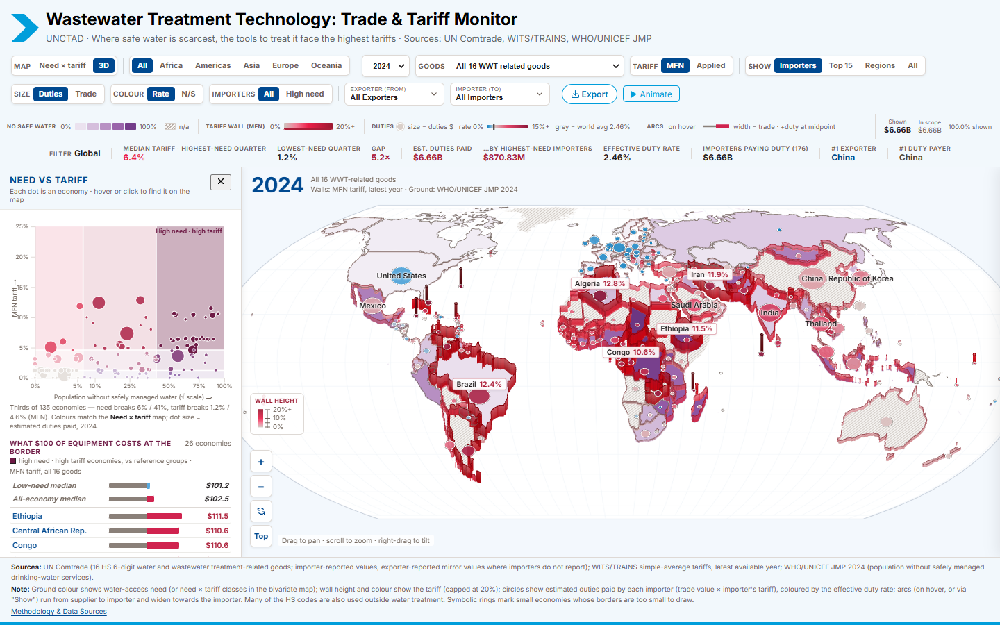

# UNCTAD Wastewater Treatment Technology: Trade & Tariff Monitor

A 2.5D dashboard showing that economies with the least access to safely managed drinking water apply the highest tariffs on water and
wastewater treatment (WWT) equipment, together with bilateral trade in that equipment.



- **Ground**: share of the population without safely managed drinking water (WHO/UNICEF JMP 2024)
- **Walls**: simple-average MFN or applied (AHS) tariff on the selected goods (WITS/TRAINS), capped at 20%
- **Arcs**: bilateral trade (UN Comtrade 2010–2024, importer-reported with exporter mirror fallback)

The UI, styling and interaction model are reused from the SHC monitor (`SHC-trade-visualization - UNCTADstyled`).
This repository is self-contained: the app, the data pipeline and its raw inputs all live here.

## Run

```bash
npm install
npm run dev       # http://localhost:5174
npm run build     # -> dist/ (static, base './', can be hosted in any folder)
npm run preview   # serve dist/ on http://localhost:8080
npm run lint      # ESLint
npm test          # build + real-browser interaction checks (see QA)
```

`main` is deployed to GitHub Pages by `.github/workflows/deploy.yml` (`npm ci`, lint, build). `.github/workflows/ci.yml`
runs lint and `npm test` on every push and pull request. Needs Node 20.19+.

## Data pipeline

`public/data/*.json` is generated; do not edit it by hand. To rebuild it from the raw inputs in `data/raw/`
(sources and provenance: [`data/raw/README.md`](data/raw/README.md)):

```bash
pip install -r requirements.txt
npm run data      # python scripts/process_wwt.py -> public/data/*.json + scripts/validation.json
```

Re-running on the committed inputs reproduces the committed outputs byte for byte. To refresh the trade data, export a new
UN Comtrade country report and run `python scripts/extract_comtrade.py <Country_Report.csv>` first.

## Layout

| Path | Purpose |
|---|---|
| `scripts/process_wwt.py` | Data pipeline: country codes, mirror trade, tariffs, water, wall geometry, validation |
| `scripts/extract_comtrade.py` | Reduces the full Comtrade export (~190 MB) to `data/raw/comtrade_wwt.csv.gz` |
| `scripts/validation.json` | Figures checked after each run (coverage, spot checks, need-quartile medians) |
| `data/raw/` | Raw pipeline inputs (trade, tariffs, water, country metadata) |
| `src/config.js` | Colours, `VIEW3D` tunables (camera angle, wall height, arc widths…), state |
| `src/data.js` | Loading, product aggregation, flow filtering (SHC auto threshold), need/tariff quartiles |
| `src/map3d.js` | Three.js scene: ground texture, tariff walls (shader), arcs, nodes, labels, picking |
| `src/main.js` | UI wiring, legend, KPIs, tooltip, animation |
| `src/panel.js` | Country panel |
| `src/scatter.js` | Need-vs-tariff analysis panel linked to the map |
| `src/csv.js`, `src/deepLink.js`, `src/methodology.js`, `src/snapshot.js` | CSV export, shareable URL hash, methodology modal, PNG export |
| `qa/` | Playwright checks against a running preview server (see below) |
| `docs/` | [`METHODOLOGY.md`](docs/METHODOLOGY.md), screenshots, and `archive/` (the original plan, build log and hand-off report) |

## QA

The QA scripts drive a real browser (Chromium with software GL). `npm test` builds, serves `dist/` on a free port, runs
`qa/interact.mjs` (~40 checks, including "JS totals = pipeline totals"; fails on any console error) and stops the server.

To run the scripts individually against a preview server:

```bash
npm run build && npm run preview          # terminal 1 (http://localhost:8080)
node qa/interact.mjs                      # terminal 2: interaction checks
node qa/shots.mjs                         # screenshots of key states -> qa/shots/ (git-ignored)
node qa/perf.mjs                          # update/year-switch timing and fps
```

Pass another base URL as the first argument if 8080 is taken (e.g. `node qa/interact.mjs http://localhost:8081/`).
The browser is found automatically (`PW_CHROME` overrides it); otherwise run `npx playwright install chromium`.

## Tuning the look

Everything visual that is likely to need adjustment is in `src/config.js`. Colour system: **one variable = one hue** in every view — need = UN purple, tariff = UN red above / UN blue below the median economy,
duties/trade = UN yellow (grey = zero / no data). Keep new encodings off those three hues.
The 2D view keeps the ground as need only and puts the tariff on the importer circles (colour); 3D puts it on walls.

- `VIEW3D.elevationDeg` (default 52°), `topViewElevationDeg` (80°), `wallMaxHeight`, `defaultZoom`
- `CONFIG.tariff.colors / domain / cap` (wall colour ramp and height cap)
- `CONFIG.need.colors / domain` (ground colour ramp)
- `CONFIG.arcRate.colors` (circle and arc colour by effective duty rate)
- `CONFIG.flowColors` (arc colours, same as the SHC monitor except N→N in UNCTAD grey)

## Important: UN map longitude offset

The UN TopoJSON (`worldmap-economies-4326.topo.json`) stores longitudes relative to a central meridian of about
**11.31°E** (decoded longitude = real longitude − 11.31). Real-world coordinates (country label points,
region centres, graticule) are rotated by `CONFIG.geoLonOffset` so that they line up with the map geometry.
`qa/measure-geo-offset.mjs` measures the offset from coastline landmarks.
